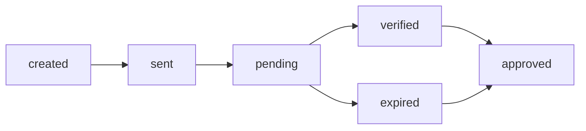

# VOCILIA_CONTEXT.md - Development Reference

## 🚀 Quick Reference

### Project URLs
- **Customer Platform**: vocilia.com
- **Business Dashboard**: business.vocilia.com
- **Admin Panel**: admin.vocilia.com
- **Supabase Dashboard**: https://supabase.com/dashboard/project/ervnxnbxsaaeakbvwieh
- **Vercel Dashboard**: https://vercel.com/lakakas-projects-b9fec40c/real-vocilia

### Key Infrastructure IDs
- **Supabase Project**: ervnxnbxsaaeakbvwieh
- **Vercel Project**: real-vocilia
- **Railway Project**: e8cca9a7-9604-4202-a44b-8266aed13561
- **Railway Service**: 80545867-88f8-409a-a75e-4087224e5be1

---

## 📊 Frequently Used Supabase Queries

### Business Operations
```sql
-- Get business with context
SELECT b.*, bc.context_data, bc.completeness_score
FROM businesses b
LEFT JOIN business_contexts bc ON b.id = bc.business_id
WHERE b.id = $1;

-- Get all stores for a business
SELECT * FROM stores
WHERE business_id = $1
ORDER BY created_at DESC;

-- Get pending verifications
SELECT * FROM verifications
WHERE business_id = $1
  AND status = 'pending'
  AND deadline > NOW();
```

### Feedback Analytics
```sql
-- Get weekly feedback for business
SELECT f.*, s.name as store_name
FROM feedbacks f
JOIN stores s ON f.store_id = s.id
WHERE s.business_id = $1
  AND f.week = $2
  AND f.released = true
ORDER BY f.quality_score DESC;

-- Calculate average quality score
SELECT
  AVG(quality_score) as avg_quality,
  COUNT(*) as total_feedback,
  SUM(reward_amount) as total_rewards
FROM feedbacks f
JOIN stores s ON f.store_id = s.id
WHERE s.business_id = $1
  AND f.created_at >= NOW() - INTERVAL '30 days';
```

### Payment Processing
```sql
-- Get consolidated payments for batch
SELECT
  phone,
  SUM(amount) as total_amount,
  COUNT(*) as transaction_count
FROM payments
WHERE week = $1
  AND status = 'pending'
GROUP BY phone
HAVING SUM(amount) >= 10; -- Minimum payout threshold
```

---

## 🔑 API Endpoints

### Customer API
```typescript
// Customer feedback submission
POST /api/customer/feedback
{
  storeCode: string,
  phone: string,
  amount: number,
  purchaseTime: string,
  audioData: Blob
}

// Get store by code
GET /api/customer/store/{code}
```

### Business API
```typescript
// Business registration
POST /api/business/register
{
  name: string,
  email: string,
  password: string
}

// Context management
GET /api/business/context
PUT /api/business/context
{
  contextData: object,
  customQuestions: array
}

// Verification workflow
GET /api/business/verifications/pending
POST /api/business/verifications/upload
{
  week: string,
  csvData: string
}
```

### Admin API
```typescript
// Payment batch creation
POST /api/admin/payments/batch
{
  week: string,
  businesses: array
}

// Feedback release
POST /api/admin/feedback/release
{
  week: string,
  businessIds: array
}
```

---

## 🏪 Store Code Patterns

### Generation Rules
- **Format**: 6 alphanumeric characters (e.g., "ABC123")
- **Excluded characters**: O, 0, I, 1, L (to avoid confusion)
- **Case insensitive**: Stored uppercase, accepted any case
- **Uniqueness**: Enforced by database constraint

### Code Generation Function
```sql
CREATE OR REPLACE FUNCTION generate_store_code()
RETURNS TEXT AS $$
DECLARE
  chars TEXT := 'ABCDEFGHJKMNPQRSTUVWXYZ23456789';
  result TEXT := '';
  i INTEGER;
BEGIN
  FOR i IN 1..6 LOOP
    result := result || substr(chars, floor(random() * length(chars) + 1)::int, 1);
  END LOOP;
  RETURN result;
END;
$$ LANGUAGE plpgsql;
```

---

## 🔄 Verification Workflow States

### Status Flow
1. **created** → Payment batch created by admin
2. **sent** → Sent to business for verification
3. **pending** → Awaiting business verification (7-day timer)
4. **verified** → Business has uploaded verification
5. **approved** → Admin approved and released feedback
6. **expired** → 7-day deadline passed (auto-approved)

### Status Transitions


---

## 🎯 Quality Score Calculation

### Scoring Weights
- **Legitimacy**: 40% - Transaction details match
- **Depth**: 25% - Length and detail of feedback
- **Constructiveness**: 20% - Actionable insights
- **Specificity**: 15% - Specific examples given

### Reward Tiers
```typescript
const getRewardPercentage = (qualityScore: number): number => {
  if (qualityScore >= 9) return 15;
  if (qualityScore >= 7) return 12;
  if (qualityScore >= 5) return 8;
  if (qualityScore >= 3) return 5;
  return 3;
};
```

---

## 🤖 AI Context System

### Context Categories
1. **Business Overview** - Type, size, mission
2. **Location Details** - Store addresses, hours
3. **Transaction Patterns** - Typical amounts, peak times
4. **Department Structure** - Teams, responsibilities
5. **Common Issues** - Known problems, solutions
6. **Custom Questions** - Business-specific inquiries

### Completeness Scoring
```typescript
const calculateCompleteness = (context: BusinessContext): number => {
  const weights = {
    businessOverview: 20,
    locationDetails: 15,
    transactionPatterns: 20,
    departmentStructure: 15,
    commonIssues: 15,
    customQuestions: 15
  };

  // Calculate weighted average based on filled sections
  return Object.entries(weights).reduce((score, [key, weight]) => {
    const filled = context[key] ? weight : 0;
    return score + filled;
  }, 0);
};
```

---

## 💳 Payment Processing

### Swish Integration
- **API Endpoint**: https://mss.cpc.getswish.net/swish-cpcapi/api/v2
- **Minimum payout**: 10 SEK
- **Consolidation period**: Weekly
- **Platform fee**: 20% on top of rewards

### Batch Processing Flow
1. Admin creates payment batch
2. System consolidates by phone number
3. Generate Swish batch file
4. Process payments via Swish API
5. Update payment status
6. Send confirmation SMS

---

## 🔐 Security Checklist

### Row Level Security (RLS)
```sql
-- Example RLS policy for businesses
CREATE POLICY "Business can only see own data"
ON feedbacks
FOR SELECT
USING (
  EXISTS (
    SELECT 1 FROM stores
    WHERE stores.id = feedbacks.store_id
    AND stores.business_id = auth.uid()
  )
);
```

### API Security
- JWT verification on all endpoints
- Rate limiting: 100 requests/minute
- Input sanitization
- CORS restricted to project domains

---

## 📝 Common Commands

### Development
```bash
# Start development server
npm run dev

# Generate TypeScript types from Supabase
npm run generate:types

# Run tests
npm run test

# Check code quality
npm run lint && npm run typecheck
```

### Database
```bash
# Run migrations
supabase migration up

# Create new migration
supabase migration new [name]

# Reset database
supabase db reset
```

### Deployment
```bash
# Deploy to Vercel
vercel deploy --prod

# Check deployment status
vercel ls

# View logs
vercel logs
```

---

## 🐛 Common Issues & Solutions

### Issue: Store code collision
**Solution**: Retry generation with collision check
```sql
LOOP
  code := generate_store_code();
  EXIT WHEN NOT EXISTS (SELECT 1 FROM stores WHERE store_code = code);
END LOOP;
```

### Issue: Verification deadline passed
**Solution**: Auto-approve with notification
```sql
UPDATE verifications
SET status = 'expired'
WHERE deadline < NOW()
  AND status = 'pending';
```

### Issue: Duplicate feedback submission
**Solution**: Unique constraint on (phone, store_id, timestamp)
```sql
ALTER TABLE feedbacks
ADD CONSTRAINT unique_feedback
UNIQUE (phone, store_id, created_at::date);
```

---

## 📚 Useful Resources

### Documentation
- [Next.js App Router](https://nextjs.org/docs/app)
- [Supabase Auth](https://supabase.com/docs/guides/auth)
- [Swish API](https://developer.swish.nu/)
- [OpenAI Whisper](https://platform.openai.com/docs/guides/speech-to-text)

### Testing Credentials
- Test phone (Sweden): +46701234567
- Test amount: 5 SEK
- Test store code: TEST01

---

## 🚀 Quick Start Checklist

- [ ] Environment variables configured
- [ ] Supabase migrations run
- [ ] TypeScript types generated
- [ ] Test business account created
- [ ] Store code generated
- [ ] Small test payment processed
- [ ] Feedback submission tested
- [ ] Verification workflow tested

---

*Last Updated: [Auto-update on save]*
*Version: 1.0.0*