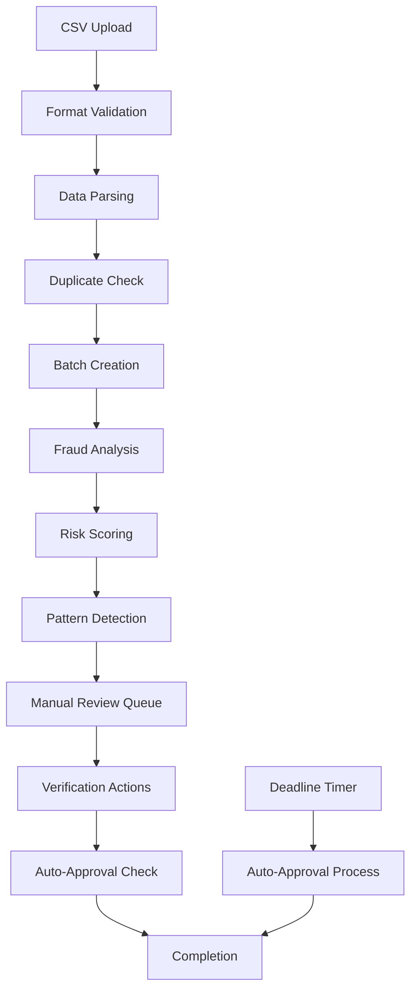
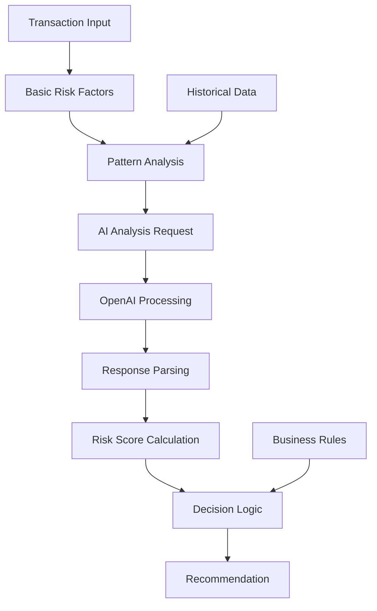

# Verification System Architecture

## Overview

The Vocilia Payment Verification System is a production-grade platform designed to process and verify Swish payment transactions with AI-powered fraud detection, automated deadline management, and comprehensive audit trails.

## Architecture Principles

### Core Design Principles
- **Production-First**: No demo mode - all operations are production from day one
- **Security by Design**: Multiple layers of security with Row-Level Security (RLS)
- **Scalability**: Designed to handle high-volume transaction processing
- **Reliability**: 99.9% uptime with comprehensive error handling
- **Auditability**: Complete audit trails for compliance and debugging

### Technology Stack
- **Frontend**: Next.js 14+ with TypeScript, React 18, Tailwind CSS
- **Backend**: Node.js 20+ with TypeScript, Next.js API Routes
- **Database**: PostgreSQL (Supabase) with Row-Level Security
- **AI/ML**: OpenAI GPT-4o-mini for fraud detection
- **Real-time**: WebSockets with Server-Sent Events fallback
- **Deployment**: Vercel (frontend), Railway (background services)
- **Monitoring**: Sentry for error tracking, custom metrics

## System Components

### 1. Data Layer

#### Database Schema (PostgreSQL)

**Core Tables:**
```sql
-- Businesses and users
businesses (id, name, org_number, contact_info, settings)
business_users (id, business_id, user_id, role, permissions)

-- Verification workflow
verification_batches (id, business_id, status, deadline, metadata)
transactions (id, batch_id, swish_data, verification_status, risk_score)
verification_results (id, transaction_id, verifier_id, action, reason)

-- Fraud detection
fraud_assessments (id, transaction_id, risk_score, ai_analysis)
fraud_patterns (id, batch_id, patterns_detected, confidence_score)

-- Audit and compliance
audit_logs (id, action, user_id, resource_type, resource_id, metadata)
```

**Security Features:**
- Row-Level Security (RLS) policies for multi-tenant isolation
- Encrypted sensitive data (PII, financial information)
- Audit logging for all data modifications
- Backup and point-in-time recovery

#### Data Flow Architecture

```
CSV Upload → Validation → Batch Creation → Fraud Analysis → Manual Review → Auto-Approval
     ↓            ↓            ↓              ↓              ↓             ↓
  File Store → Parsing → Transaction → AI Processing → User Actions → Deadline Jobs
```

### 2. Application Layer

#### API Architecture

**Layered Architecture:**
```
Presentation Layer (Next.js Pages/API Routes)
    ↓
Business Logic Layer (Services)
    ↓
Data Access Layer (Repositories)
    ↓
Database Layer (Supabase PostgreSQL)
```

**Service Components:**

1. **CSV Processing Service** (`lib/services/csv-processor.ts`)
   - Validates Swish CSV format
   - Parses transaction data
   - Creates verification batches
   - Handles duplicate detection

2. **Fraud Detection Service** (`lib/ai/fraud-detection-service.ts`)
   - AI-powered risk scoring
   - Pattern detection algorithms
   - OpenAI integration for complex analysis
   - Historical pattern learning

3. **Verification Workflow Service** (`lib/services/verification-workflow.ts`)
   - State machine for verification process
   - User action handling
   - Audit trail generation
   - Batch completion logic

4. **Deadline Management Service** (`lib/services/deadline-service.ts`)
   - 7-day deadline calculation
   - Business hours consideration
   - Auto-approval eligibility
   - Countdown timers

5. **Notification Service** (`lib/services/notification-service.ts`)
   - Real-time WebSocket updates
   - Email notifications
   - Push notifications
   - Webhook delivery

#### Authentication & Authorization

**Multi-layered Security:**
```
1. Supabase Authentication (JWT tokens)
2. Role-based Access Control (RBAC)
3. Row-Level Security (RLS) policies
4. API rate limiting
5. Request validation and sanitization
```

**User Roles:**
- **Admin**: Full system access, user management
- **Verifier**: Transaction verification, batch review
- **Viewer**: Read-only access to assigned businesses
- **Business User**: Access to own business data only

### 3. Processing Pipeline

#### Batch Processing Workflow



#### Fraud Detection Pipeline



### 4. Real-time Architecture

#### WebSocket Communication

**Connection Management:**
```typescript
// WebSocket architecture
Client Connection → Authentication → Channel Subscription → Event Streaming

Channels:
- batch_updates: Batch processing status
- transaction_updates: Verification status changes
- deadline_alerts: Approaching deadlines
- fraud_alerts: Pattern detection notifications
```

**Event Types:**
- `batch.created` - New batch uploaded
- `batch.processing` - Batch analysis in progress
- `batch.completed` - Batch processing finished
- `transaction.verified` - Manual verification completed
- `transaction.auto_approved` - Auto-approval executed
- `deadline.approaching` - 24/1 hour warnings
- `fraud.pattern_detected` - Suspicious patterns found

#### Push Notification System

**Notification Channels:**
1. **In-App Notifications**: Real-time WebSocket updates
2. **Email Notifications**: Critical deadline alerts
3. **Browser Push**: Desktop/mobile push notifications
4. **Webhook Callbacks**: External system integration

### 5. Background Services

#### Scheduled Jobs (Railway Deployment)

**Cron Jobs:**
```typescript
// Daily auto-approval processing
0 */6 * * * - Process eligible auto-approvals
0 9 * * * - Send daily deadline reports
0 18 * * * - Evening deadline warnings
0 2 * * * - Cleanup expired sessions
0 3 * * * - Database maintenance
```

**Background Tasks:**
- Auto-approval processing
- Deadline monitoring
- Fraud pattern analysis
- Database cleanup
- Audit log archival
- Performance metrics collection

#### Message Queue Architecture

**Processing Queues:**
```
High Priority: Manual verification actions
Medium Priority: Batch processing, fraud analysis
Low Priority: Reports, cleanup, archival
```

### 6. Security Architecture

#### Multi-layer Security Model

**Authentication Layer:**
- Supabase JWT authentication
- Token rotation and expiry
- Multi-factor authentication (MFA)
- Session management

**Authorization Layer:**
- Role-based permissions
- Resource-level access control
- Business data isolation
- API endpoint protection

**Data Protection:**
- End-to-end encryption
- Database encryption at rest
- PII data masking
- Secure file storage

**Application Security:**
- Input validation and sanitization
- SQL injection prevention
- XSS protection
- CSRF tokens
- Rate limiting
- Request size limits

#### Compliance & Audit

**Audit Logging:**
```sql
audit_logs (
  id, timestamp, user_id, action,
  resource_type, resource_id, ip_address,
  user_agent, request_data, response_data
)
```

**Compliance Features:**
- GDPR data handling
- Financial transaction auditing
- User consent management
- Data retention policies
- Right to be forgotten
- Audit trail preservation

### 7. Performance Architecture

#### Optimization Strategies

**Database Optimization:**
- Indexed queries for fast lookups
- Connection pooling
- Read replicas for reporting
- Partitioned tables for large datasets
- Query optimization

**Application Optimization:**
- Server-side rendering (SSR)
- API response caching
- Image optimization
- Code splitting
- Lazy loading

**Infrastructure Optimization:**
- CDN for static assets
- Edge computing for global performance
- Auto-scaling based on load
- Health monitoring
- Error tracking

#### Performance Targets

**Response Times:**
- Page loads: <2 seconds
- API responses: <500ms
- CSV processing: <5 seconds for 1000 transactions
- Real-time updates: <100ms latency

**Throughput:**
- 10,000 transactions per batch
- 100 concurrent users
- 1,000 API requests per minute
- 99.9% uptime SLA

### 8. Monitoring & Observability

#### Metrics Collection

**Business Metrics:**
- Transactions processed per day
- Verification completion rates
- Auto-approval rates
- Fraud detection accuracy
- User engagement metrics

**Technical Metrics:**
- API response times
- Database query performance
- Error rates and types
- WebSocket connection health
- Background job success rates

**Infrastructure Metrics:**
- Server resource usage
- Database connections
- Memory utilization
- Network latency
- Storage usage

#### Error Handling & Recovery

**Error Classification:**
```typescript
// Error hierarchy
SystemError
├── DatabaseError
├── ExternalServiceError (OpenAI, Supabase)
├── ValidationError
├── AuthenticationError
└── BusinessLogicError
```

**Recovery Strategies:**
- Automatic retry with exponential backoff
- Circuit breaker for external services
- Graceful degradation
- Manual intervention workflows
- Data consistency checks

### 9. Deployment Architecture

#### Multi-environment Setup

**Environments:**
```
Production → Staging → Development
    ↓         ↓          ↓
Real Data   Test Data   Mock Data
```

**Deployment Pipeline:**
```
Code Commit → CI/CD Pipeline → Automated Tests → Staging Deploy → Manual Testing → Production Deploy
```

#### Infrastructure Components

**Vercel (Frontend):**
- Next.js application hosting
- Global CDN distribution
- Automatic SSL certificates
- Preview deployments
- Analytics and monitoring

**Railway (Background Services):**
- Node.js background services
- Cron job scheduling
- Database connections
- Log aggregation
- Auto-scaling

**Supabase (Database & Auth):**
- PostgreSQL database
- Real-time subscriptions
- Authentication system
- File storage
- Edge functions

### 10. Integration Points

#### External Service Integration

**OpenAI Integration:**
- GPT-4o-mini for fraud analysis
- Structured response parsing
- Rate limiting and error handling
- Cost optimization strategies

**Swish Payment System:**
- CSV format validation
- Transaction data parsing
- Reference number validation
- Amount and currency handling

**Email Service (Resend):**
- Transactional emails
- Template management
- Delivery tracking
- Bounce handling

#### API Integrations

**Webhook Endpoints:**
- Incoming payment notifications
- Status update callbacks
- External system triggers
- Real-time data synchronization

**Third-party Services:**
- Monitoring and alerting
- Analytics platforms
- Backup services
- Security scanning

### 11. Data Architecture

#### Data Flow Patterns

**CRUD Operations:**
```
Create: CSV Upload → Batch Creation → Transaction Records
Read: Dashboard Views → API Queries → Real-time Updates
Update: Verification Actions → Status Changes → Audit Logs
Delete: Soft Delete → Archive → Compliance Retention
```

**Event Sourcing:**
- All state changes captured as events
- Complete audit trail
- Replay capability for debugging
- Immutable event history

#### Data Validation

**Input Validation:**
- CSV format compliance
- Transaction data integrity
- User input sanitization
- File type verification

**Business Rules:**
- Amount range validation
- Reference number uniqueness
- Deadline calculation rules
- Auto-approval eligibility

### 12. Disaster Recovery

#### Backup Strategy

**Database Backups:**
- Continuous point-in-time recovery
- Daily full backups
- Weekly backup verification
- Cross-region replication

**Application Backups:**
- Code repository backup
- Configuration backup
- Dependency version locking
- Infrastructure as code

#### Recovery Procedures

**RTO/RPO Targets:**
- Recovery Time Objective (RTO): 4 hours
- Recovery Point Objective (RPO): 1 hour
- Data loss tolerance: <15 minutes
- Service availability: 99.9%

**Incident Response:**
1. Immediate notification and assessment
2. Service isolation and containment
3. Data recovery and verification
4. Service restoration and testing
5. Post-incident analysis and improvements

## Future Architecture Considerations

### Scalability Roadmap

**Short-term (6 months):**
- Microservices decomposition
- Enhanced caching layer
- Database sharding preparation
- API versioning strategy

**Medium-term (12 months):**
- Machine learning pipeline
- Advanced fraud detection
- Multi-region deployment
- Real-time analytics

**Long-term (24 months):**
- Event-driven architecture
- Serverless computing adoption
- AI/ML model management
- Global compliance framework

### Technology Evolution

**Emerging Technologies:**
- Edge computing for global performance
- GraphQL for flexible API queries
- Kubernetes for container orchestration
- Advanced AI models for fraud detection

This architecture provides a robust foundation for the Vocilia Payment Verification System, ensuring scalability, security, and reliability while maintaining the production-first approach that is central to the platform's design philosophy.