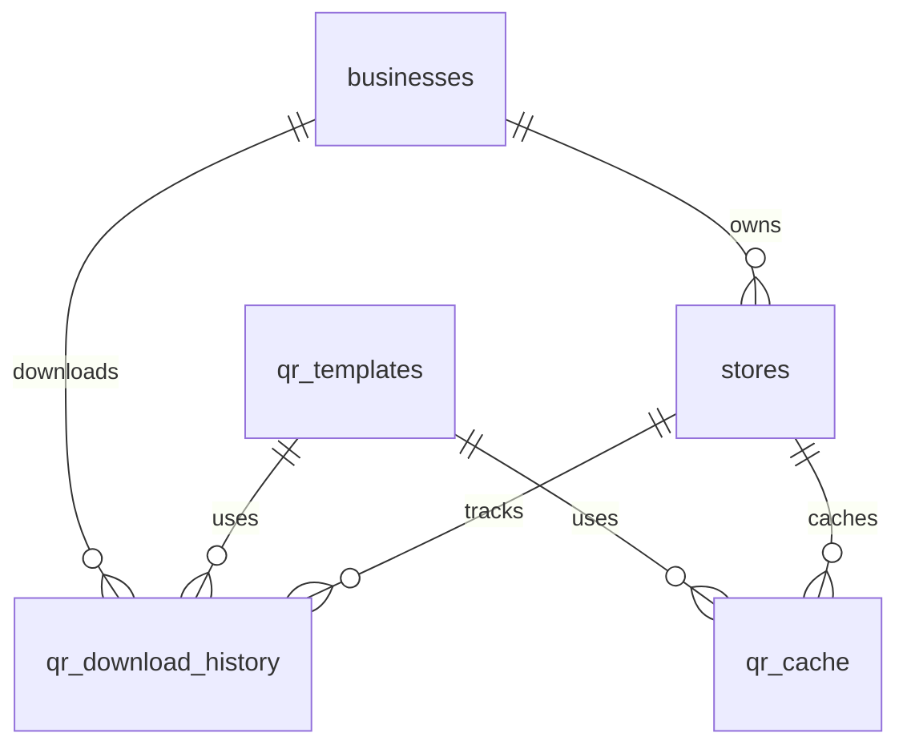

# Data Model: QR Code Generation & Download

**Feature**: QR Code Generation for Store Feedback Entry
**Date**: 2025-09-16
**Branch**: 001-6-2-qr

## Entity Definitions

### 1. Store (Existing - Enhanced)
**Table**: `stores` (existing)

**Existing Fields**:
- `id`: UUID - Primary key
- `business_id`: UUID - References businesses(id)
- `name`: VARCHAR(255) - Store name
- `store_code`: VARCHAR(6) - Unique 6-digit code
- `location_address`: TEXT
- `location_city`: VARCHAR(100)
- `is_active`: BOOLEAN
- `created_at`: TIMESTAMPTZ
- `updated_at`: TIMESTAMPTZ

**New Fields to Add**:
- `qr_version`: INTEGER - QR code version (for updates)
- `qr_generated_at`: TIMESTAMPTZ - Last QR generation time
- `qr_logo_enabled`: BOOLEAN - Whether to include logo (default: true)

### 2. QR Code Templates
**Table**: `qr_templates` (new)

**Fields**:
- `id`: UUID - Primary key
- `name`: VARCHAR(50) - Template name (counter/wall/window)
- `width_cm`: DECIMAL(5,2) - Physical width in cm
- `height_cm`: DECIMAL(5,2) - Physical height in cm
- `qr_size_px`: INTEGER - QR module size in pixels
- `dpi`: INTEGER - Print resolution (default: 300)
- `padding_px`: INTEGER - Padding around QR code
- `font_size_code`: INTEGER - Font size for store code
- `font_size_instructions`: INTEGER - Font size for instructions
- `is_active`: BOOLEAN - Whether template is available
- `created_at`: TIMESTAMPTZ
- `updated_at`: TIMESTAMPTZ

**Initial Data**:
```sql
-- Counter display
('counter', 10, 10, 280, 300, 20, 14, 10, true)
-- Wall poster
('wall', 21, 21, 600, 300, 30, 18, 12, true)
-- Window display
('window', 30, 30, 900, 300, 40, 24, 14, true)
```

### 3. QR Download History
**Table**: `qr_download_history` (new)

**Fields**:
- `id`: UUID - Primary key
- `store_id`: UUID - References stores(id)
- `business_id`: UUID - References businesses(id)
- `template_id`: UUID - References qr_templates(id)
- `format`: VARCHAR(10) - File format (PDF/PNG/SVG)
- `file_url`: TEXT - Supabase Storage URL
- `file_size_kb`: INTEGER - File size in KB
- `downloaded_by`: UUID - User who downloaded
- `downloaded_at`: TIMESTAMPTZ - Download timestamp
- `ip_address`: INET - IP address for audit
- `user_agent`: TEXT - Browser info
- `qr_version`: INTEGER - Version of QR at download time
- `created_at`: TIMESTAMPTZ

**Indexes**:
- `idx_qr_download_store_id` ON (store_id)
- `idx_qr_download_business_id` ON (business_id)
- `idx_qr_download_downloaded_at` ON (downloaded_at)

### 4. QR Cache
**Table**: `qr_cache` (new)

**Fields**:
- `id`: UUID - Primary key
- `store_id`: UUID - References stores(id)
- `template_id`: UUID - References qr_templates(id)
- `format`: VARCHAR(10) - File format
- `qr_version`: INTEGER - QR code version
- `file_path`: TEXT - Supabase Storage path
- `file_url`: TEXT - Public URL (signed)
- `file_size_kb`: INTEGER - File size
- `checksum`: VARCHAR(64) - SHA-256 hash
- `generated_at`: TIMESTAMPTZ - Generation time
- `accessed_at`: TIMESTAMPTZ - Last access time
- `access_count`: INTEGER - Number of accesses
- `expires_at`: TIMESTAMPTZ - Cache expiry (30 days)

**Indexes**:
- `idx_qr_cache_store_template` ON (store_id, template_id, format)
- `idx_qr_cache_expires` ON (expires_at)

### 5. QR Translations
**Table**: `qr_translations` (new)

**Fields**:
- `id`: UUID - Primary key
- `language_code`: VARCHAR(5) - Language (sv/en)
- `key`: VARCHAR(100) - Translation key
- `value`: TEXT - Translated text
- `context`: VARCHAR(50) - Usage context (instruction/ui/email)
- `created_at`: TIMESTAMPTZ
- `updated_at`: TIMESTAMPTZ

**Initial Data**:
```sql
-- Swedish translations
('sv', 'scan_prompt', 'Skanna för att ge feedback', 'instruction')
('sv', 'cashback_info', 'Få upp till 15% cashback', 'instruction')
('sv', 'step_1', '1. Skanna QR-koden med din mobil', 'instruction')
('sv', 'step_2', '2. Berätta om din upplevelse', 'instruction')
('sv', 'step_3', '3. Få cashback direkt via Swish', 'instruction')
('sv', 'store_code_label', 'Kod', 'instruction')

-- English translations
('en', 'scan_prompt', 'Scan to give feedback', 'instruction')
('en', 'cashback_info', 'Get up to 15% cashback', 'instruction')
('en', 'step_1', '1. Scan the QR code with your phone', 'instruction')
('en', 'step_2', '2. Share your experience', 'instruction')
('en', 'step_3', '3. Get cashback instantly via Swish', 'instruction')
('en', 'store_code_label', 'Code', 'instruction')
```

## Relationships



## Data Validation Rules

### Store (Enhanced)
- `qr_version`: Must be >= 1, auto-increment on changes
- `qr_logo_enabled`: Default true for new stores

### QR Templates
- `name`: Must be unique and in ['counter', 'wall', 'window']
- `width_cm`, `height_cm`: Must be positive numbers
- `qr_size_px`: Must be between 100 and 2000
- `dpi`: Must be >= 72, typically 300

### QR Download History
- `format`: Must be in ['PDF', 'PNG', 'SVG']
- `file_size_kb`: Must be positive
- One record per download event (no updates)

### QR Cache
- `format`: Must be in ['PDF', 'PNG', 'SVG']
- `checksum`: SHA-256 hash of file content
- `expires_at`: Set to generated_at + 30 days
- Auto-delete expired records via cron job

### QR Translations
- `language_code`: Must be in ['sv', 'en']
- `key`: Must be unique within language_code
- `context`: Must be in ['instruction', 'ui', 'email']

## State Transitions

### QR Generation Flow
```
1. Store Created → qr_version = 1
2. Store Updated → qr_version++
3. QR Generated → Check cache
   - Cache hit → Return cached file
   - Cache miss → Generate new, save to cache
4. QR Downloaded → Log to history
5. Cache expires → Delete after 30 days
```

### Store Code Changes
```
1. Store code should never change (permanent)
2. If absolutely necessary:
   - Increment qr_version
   - Invalidate all cache entries
   - Send notification to business
   - Old QR codes redirect to error page
```

## Migration Scripts

### Migration 003: Add QR Code Support
```sql
-- Add new fields to stores table
ALTER TABLE stores
ADD COLUMN qr_version INTEGER DEFAULT 1,
ADD COLUMN qr_generated_at TIMESTAMPTZ,
ADD COLUMN qr_logo_enabled BOOLEAN DEFAULT true;

-- Create qr_templates table
CREATE TABLE qr_templates (
  id UUID PRIMARY KEY DEFAULT gen_random_uuid(),
  name VARCHAR(50) UNIQUE NOT NULL,
  width_cm DECIMAL(5,2) NOT NULL,
  height_cm DECIMAL(5,2) NOT NULL,
  qr_size_px INTEGER NOT NULL,
  dpi INTEGER DEFAULT 300,
  padding_px INTEGER DEFAULT 20,
  font_size_code INTEGER NOT NULL,
  font_size_instructions INTEGER NOT NULL,
  is_active BOOLEAN DEFAULT true,
  created_at TIMESTAMPTZ DEFAULT NOW(),
  updated_at TIMESTAMPTZ DEFAULT NOW()
);

-- Create qr_download_history table
CREATE TABLE qr_download_history (
  id UUID PRIMARY KEY DEFAULT gen_random_uuid(),
  store_id UUID NOT NULL REFERENCES stores(id) ON DELETE CASCADE,
  business_id UUID NOT NULL REFERENCES businesses(id) ON DELETE CASCADE,
  template_id UUID NOT NULL REFERENCES qr_templates(id),
  format VARCHAR(10) NOT NULL,
  file_url TEXT,
  file_size_kb INTEGER,
  downloaded_by UUID,
  downloaded_at TIMESTAMPTZ DEFAULT NOW(),
  ip_address INET,
  user_agent TEXT,
  qr_version INTEGER NOT NULL,
  created_at TIMESTAMPTZ DEFAULT NOW()
);

-- Create qr_cache table
CREATE TABLE qr_cache (
  id UUID PRIMARY KEY DEFAULT gen_random_uuid(),
  store_id UUID NOT NULL REFERENCES stores(id) ON DELETE CASCADE,
  template_id UUID NOT NULL REFERENCES qr_templates(id),
  format VARCHAR(10) NOT NULL,
  qr_version INTEGER NOT NULL,
  file_path TEXT NOT NULL,
  file_url TEXT,
  file_size_kb INTEGER,
  checksum VARCHAR(64) NOT NULL,
  generated_at TIMESTAMPTZ DEFAULT NOW(),
  accessed_at TIMESTAMPTZ DEFAULT NOW(),
  access_count INTEGER DEFAULT 1,
  expires_at TIMESTAMPTZ NOT NULL
);

-- Create qr_translations table
CREATE TABLE qr_translations (
  id UUID PRIMARY KEY DEFAULT gen_random_uuid(),
  language_code VARCHAR(5) NOT NULL,
  key VARCHAR(100) NOT NULL,
  value TEXT NOT NULL,
  context VARCHAR(50) NOT NULL,
  created_at TIMESTAMPTZ DEFAULT NOW(),
  updated_at TIMESTAMPTZ DEFAULT NOW(),
  UNIQUE(language_code, key)
);

-- Create indexes
CREATE INDEX idx_qr_download_store_id ON qr_download_history(store_id);
CREATE INDEX idx_qr_download_business_id ON qr_download_history(business_id);
CREATE INDEX idx_qr_download_downloaded_at ON qr_download_history(downloaded_at);
CREATE INDEX idx_qr_cache_store_template ON qr_cache(store_id, template_id, format);
CREATE INDEX idx_qr_cache_expires ON qr_cache(expires_at);

-- Enable RLS
ALTER TABLE qr_templates ENABLE ROW LEVEL SECURITY;
ALTER TABLE qr_download_history ENABLE ROW LEVEL SECURITY;
ALTER TABLE qr_cache ENABLE ROW LEVEL SECURITY;
ALTER TABLE qr_translations ENABLE ROW LEVEL SECURITY;

-- RLS Policies
CREATE POLICY "Public can view templates" ON qr_templates
  FOR SELECT USING (is_active = true);

CREATE POLICY "Businesses can view own download history" ON qr_download_history
  FOR SELECT USING (business_id = auth.uid());

CREATE POLICY "Businesses can download QR codes" ON qr_download_history
  FOR INSERT WITH CHECK (business_id = auth.uid());

CREATE POLICY "System can manage cache" ON qr_cache
  FOR ALL USING (true);

CREATE POLICY "Public can view translations" ON qr_translations
  FOR SELECT USING (true);

-- Insert initial template data
INSERT INTO qr_templates (name, width_cm, height_cm, qr_size_px, font_size_code, font_size_instructions)
VALUES
  ('counter', 10, 10, 280, 14, 10),
  ('wall', 21, 21, 600, 18, 12),
  ('window', 30, 30, 900, 24, 14);

-- Insert initial translations
INSERT INTO qr_translations (language_code, key, value, context) VALUES
  ('sv', 'scan_prompt', 'Skanna för att ge feedback', 'instruction'),
  ('sv', 'cashback_info', 'Få upp till 15% cashback', 'instruction'),
  ('sv', 'step_1', '1. Skanna QR-koden med din mobil', 'instruction'),
  ('sv', 'step_2', '2. Berätta om din upplevelse', 'instruction'),
  ('sv', 'step_3', '3. Få cashback direkt via Swish', 'instruction'),
  ('sv', 'store_code_label', 'Kod', 'instruction'),
  ('en', 'scan_prompt', 'Scan to give feedback', 'instruction'),
  ('en', 'cashback_info', 'Get up to 15% cashback', 'instruction'),
  ('en', 'step_1', '1. Scan the QR code with your phone', 'instruction'),
  ('en', 'step_2', '2. Share your experience', 'instruction'),
  ('en', 'step_3', '3. Get cashback instantly via Swish', 'instruction'),
  ('en', 'store_code_label', 'Code', 'instruction');
```

## Performance Considerations

### Indexes
- Composite index on cache for quick lookups
- Time-based indexes for cleanup operations
- Business/store indexes for filtering

### Caching Strategy
- 30-day retention for generated files
- LRU eviction if storage exceeds limits
- Background job for expired cache cleanup

### Query Optimization
- Batch downloads use single query with joins
- Pagination for download history (limit 50)
- Materialized view for download statistics (future)

---
*Data model complete. Ready for contract generation.*